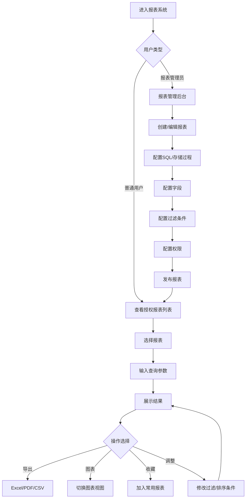

# EAMS2026 报表模块设计文档

> 版本：v0.1.260605  
> 状态：初稿  
> 关联文档：[EAMS_4.6老项目迁移评估.md](EAMS_4.6老项目迁移评估.md)

---

## 1. 老报表模块不足分析

### 1.1 架构缺陷

| # | 问题 | 说明 | 影响 |
|---|------|------|------|
| 1 | **严重SQL注入风险** | DAL层全部使用字符串拼接 `"'%" + fieldName + "%'"`，无参数化查询 | 安全漏洞，数据泄露风险 |
| 2 | **静态状态共享** | `private static DataTable _dataTable` 静态变量 | 多用户并发时数据错乱 |
| 3 | **DataTable紧耦合** | 数据层直接返回 `DataTable`，无强类型DTO | 前端无法确定字段结构，类型不安全 |
| 4 | **调用链僵化** | BLL -> DAL 扁平两层，无Service/Repository分层 | 难以扩展、测试 |
| 5 | **ERP数据库强依赖** | `erpContextBase` 硬编码到代码中 | 无法切换数据源，迁移困难 |

### 1.2 功能缺陷

| # | 问题 | 说明 |
|---|------|------|
| 6 | **前端渲染原始** | jQuery + 字符串拼HTML `getBody()` 生成表格，无组件化 |
| 7 | **分页名存实亡** | `pageStrip.js` 只有空壳 `alert(idx)`，后端无分页接口 |
| 8 | **无数据导出功能** | 没有 Excel/PDF/CSV 导出能力 |
| 9 | **无图表展示** | 仅有表格，无任何可视化图表 |
| 10 | **过滤条件空实现** | `getFilterCmd()` 返回空字符串，过滤逻辑无效 |
| 11 | **无报表参数化** | 不支持自定义参数输入（日期范围、下拉选择等） |
| 12 | **无报表调度** | 不支持报表定时生成、邮件发送 |
| 13 | **无报表收藏/常用** | 用户不能收藏常用报表 |

### 1.3 体验缺陷

| # | 问题 | 说明 |
|---|------|------|
| 14 | **加载无状态反馈** | 无loading指示、无错误提示 |
| 15 | **列宽不可调整** | 表格列宽固定 |
| 16 | **无数据排序交互** | 不能点击列头排序 |
| 17 | **无汇总行** | 不能显示合计/小计 |
| 18 | **权限仅用户级** | 不支持角色级权限、字段级权限控制未启用 |

### 1.4 技术债务

| # | 问题 | 说明 |
|---|------|------|
| 19 | **无单元测试** | 项目不含任何测试代码 |
| 20 | **无日志审计** | 无操作日志记录 |
| 21 | **重复DA层代码** | 每个实体一个DAL文件，大量重复的CRUD模板代码 |
| 22 | **表名无前缀** | 直接使用 `Reports`、`report_Fields` 命名，与其他模块冲突风险 |

---

## 2. 新设计考虑的原因

### 2.1 架构层面

| 决策 | 原因 | 收益 |
|------|------|------|
| **采用分层架构**（Controller → Service → Repository） | 遵循现有EAMS2026架构模式 | 统一架构，便于维护和测试 |
| **DTO模式** | `DataTable` 无法序列化、无法验证 | 类型安全，Swagger文档自动生成 |
| **参数化查询** | 老项目SQL注入漏洞 | 安全性大幅提升 |
| **去静态化** | 避免并发数据污染 | 线程安全 |
| **数据源抽象** | 支持多数据库（PostgreSQL + ERP | 解耦ERP依赖 |

### 2.2 功能层面

| 决策 | 原因 | 收益 |
|------|------|------|
| **前端组件化 (Vue 3)** | 替代jQuery字符串拼HTML | 可维护性、可复用性 | 
| **服务端分页** | 大数据集性能优化 | 秒级响应 |
| **报表参数化** | 支持日期范围、下拉选择、文本输入 | 灵活查询 |
| **多种导出格式** | Excel/PDF/CSV | 满足业务需求 |
| **图表展示 (ECharts)** | 可视化分析 | 直观数据洞察 |
| **过滤条件引擎** | 老版过滤条件未实现 | 数据精确筛选 |

### 2.3 安全与运维

| 决策 | 原因 | 收益 |
|------|------|------|
| **操作日志审计** | 谁在何时看了什么报表 | 可追溯、合规 |
| **角色+用户权限** | 替代仅用户级权限 | 更灵活的权限管理 |
| **SQL执行白名单** | 限制动态SQL | 防止SQL注入 |

---

## 3. 功能模块设计

### 3.1 功能树

```
报表系统 (Report)
├── 报表管理
│   ├── 报表创建（SQL模式 / 存储过程模式 / 表选择模式）
│   ├── 报表编辑
│   ├── 报表删除
│   ├── 报表预览
│   └── 报表分类管理
├── 报表设计器
│   ├── 字段配置（显示/隐藏/排序）
│   ├── 过滤条件配置
│   ├── 排序配置（多字段）
│   ├── 分组配置
│   ├── 汇总配置（求和/平均/计数/最大/最小）
│   └── 图表配置（柱状/折线/饼图/表格）
├── 报表查看
│   ├── 参数输入（日期范围/下拉选择/文本输入）
│   ├── 表格展示（排序/列宽/固定列）
│   ├── 图表展示（ECharts）
│   ├── 数据导出（Excel/PDF/CSV）
│   ├── 打印
│   └── 全屏查看
├── 权限管理
│   ├── 报表级权限（可见/不可见）
│   ├── 字段级权限（可看/不可看）
│   └── 数据行级权限（按部门/按区域）
└── 个人设置
    ├── 常用报表收藏
    ├── 报表排序偏好
    └── 报表列布局保存
```

### 3.2 用户流转



---

## 4. 数据模型设计

### 4.1 表结构

#### 4.1.1 `rpt_report` 报表主表

| 字段名 | 类型 | 说明 | 备注 |
|--------|------|------|------|
| `id` | `uuid` PK | 主键 | 自动生成 |
| `name` | `varchar(200)` | 报表名称 | 唯一 |
| `title` | `varchar(500)` | 显示标题 | |
| `description` | `text` | 描述说明 | |
| `category_id` | `uuid` FK | 所属分类 | → `rpt_category.id` |
| `query_type` | `varchar(20)` | 查询类型 | `sql` / `proc` / `table` |
| `query_text` | `text` | SQL查询语句 | 参数占位符 `@param` |
| `query_datasource` | `varchar(50)` | 数据源标识 | `main`(主库) / `erp`(ERP库) |
| `is_process_with_params` | `boolean` | 是否使用参数化查询 | 默认 false |
| `is_system` | `boolean` | 是否系统内置 | 系统内置不可删除 |
| `status` | `varchar(20)` | 状态 | `draft` / `published` / `disabled` |
| `created_at` | `timestamp` | 创建时间 | |
| `created_by` | `uuid` FK | 创建人 | → `users.id` |
| `updated_at` | `timestamp` | 更新时间 | |
| `updated_by` | `uuid` FK | 更新人 | → `users.id` |

#### 4.1.2 `rpt_field` 报表字段表

| 字段名 | 类型 | 说明 | 备注 |
|--------|------|------|------|
| `id` | `uuid` PK | 主键 | |
| `report_id` | `uuid` FK | 所属报表 | → `rpt_report.id` |
| `field_name` | `varchar(200)` | 字段名称（对应SQL列名） | |
| `field_title` | `varchar(200)` | 显示标题 | |
| `field_type` | `varchar(50)` | 字段类型 | `string`/`number`/`date`/`boolean`/`money` |
| `sort_order` | `int` | 显示排序 | |
| `width` | `int` | 列宽(px) | 0=自动 |
| `align` | `varchar(10)` | 对齐方式 | `left`/`center`/`right` |
| `is_display` | `boolean` | 是否显示 | 默认 true |
| `is_sortable` | `boolean` | 是否可排序 | 默认 true |
| `is_filterable` | `boolean` | 是否可过滤 | 默认 false |
| `is_groupable` | `boolean` | 是否可分组 | 默认 false |
| `is_summary` | `boolean` | 是否汇总 | 默认 false |
| `summary_type` | `varchar(20)` | 汇总类型 | `sum`/`avg`/`count`/`max`/`min` |
| `format_pattern` | `varchar(100)` | 格式化模式 | 如 `#,##0.00` |
| `created_at` | `timestamp` | 创建时间 | |

#### 4.1.3 `rpt_filter` 过滤条件配置表

| 字段名 | 类型 | 说明 | 备注 |
|--------|------|------|------|
| `id` | `uuid` PK | 主键 | |
| `report_id` | `uuid` FK | 所属报表 | → `rpt_report.id` |
| `field_name` | `varchar(200)` | 字段名 | |
| `label` | `varchar(200)` | 显示标签 | |
| `operator` | `varchar(20)` | 比较操作符 | `eq`/`ne`/`gt`/`ge`/`lt`/`le`/`like`/`in`/`between` |
| `default_value` | `text` | 默认值 | |
| `control_type` | `varchar(30)` | 控件类型 | `text`/`select`/`date`/`daterange`/`number`/`checkbox` |
| `options_query` | `text` | 选项查询SQL（下拉框数据源） | 仅 `select` 类型 |
| `sort_order` | `int` | 显示排序 | |
| `is_required` | `boolean` | 是否必填 | 默认 false |
| `created_at` | `timestamp` | 创建时间 | |

#### 4.1.4 `rpt_sort` 默认排序配置表

| 字段名 | 类型 | 说明 | 备注 |
|--------|------|------|------|
| `id` | `uuid` PK | 主键 | |
| `report_id` | `uuid` FK | 所属报表 | → `rpt_report.id` |
| `field_name` | `varchar(200)` | 排序字段 | |
| `direction` | `varchar(4)` | 方向 | `asc` / `desc` |
| `sort_order` | `int` | 排序优先级 | |
| `created_at` | `timestamp` | 创建时间 | |

#### 4.1.5 `rpt_chart` 图表配置表

| 字段名 | 类型 | 说明 | 备注 |
|--------|------|------|------|
| `id` | `uuid` PK | 主键 | |
| `report_id` | `uuid` FK | 所属报表 | → `rpt_report.id` |
| `chart_type` | `varchar(20)` | 图表类型 | `bar`/`line`/`pie`/`scatter`/`radar` |
| `title` | `varchar(200)` | 图表标题 | |
| `x_field` | `varchar(200)` | X轴字段 | |
| `y_fields` | `jsonb` | Y轴字段列表 | `["field1","field2"]` |
| `group_field` | `varchar(200)` | 分组字段 | 可选 |
| `options` | `jsonb` | 扩展配置 | 颜色、堆叠等 |
| `sort_order` | `int` | 显示排序 | |
| `created_at` | `timestamp` | 创建时间 | |

#### 4.1.6 `rpt_category` 报表分类表

| 字段名 | 类型 | 说明 | 备注 |
|--------|------|------|------|
| `id` | `uuid` PK | 主键 | |
| `name` | `varchar(100)` | 分类名称 | |
| `parent_id` | `uuid` FK | 父分类 | 自引用，null=顶级 |
| `sort_order` | `int` | 排序 | |
| `created_at` | `timestamp` | 创建时间 | |

#### 4.1.7 `rpt_permission` 报表权限表

| 字段名 | 类型 | 说明 | 备注 |
|--------|------|------|------|
| `id` | `uuid` PK | 主键 | |
| `report_id` | `uuid` FK | 报表ID | → `rpt_report.id` |
| `principal_type` | `varchar(10)` | 主体类型 | `role` / `user` |
| `principal_id` | `uuid` | 主体ID | role_id 或 user_id |
| `access_type` | `varchar(20)` | 访问类型 | `view` / `export` / `manage` |
| `created_at` | `timestamp` | 创建时间 | |

#### 4.1.8 `rpt_field_permission` 字段级权限表

| 字段名 | 类型 | 说明 | 备注 |
|--------|------|------|------|
| `id` | `uuid` PK | 主键 | |
| `report_id` | `uuid` FK | 报表ID | |
| `field_name` | `varchar(200)` | 字段名 | |
| `principal_type` | `varchar(10)` | 主体类型 | `role` / `user` |
| `principal_id` | `uuid` | 主体ID | |
| `is_visible` | `boolean` | 是否可见 | 默认 true |
| `created_at` | `timestamp` | 创建时间 | |

#### 4.1.9 `rpt_bookmark` 用户收藏表

| 字段名 | 类型 | 说明 | 备注 |
|--------|------|------|------|
| `id` | `uuid` PK | 主键 | |
| `user_id` | `uuid` FK | 用户ID | → `users.id` |
| `report_id` | `uuid` FK | 报表ID | → `rpt_report.id` |
| `sort_order` | `int` | 排序 | |
| `created_at` | `timestamp` | 创建时间 | |

#### 4.1.10 `rpt_execution_log` 执行日志表

| 字段名 | 类型 | 说明 | 备注 |
|--------|------|------|------|
| `id` | `uuid` PK | 主键 | |
| `report_id` | `uuid` FK | 报表ID | |
| `user_id` | `uuid` FK | 执行用户 | |
| `params` | `jsonb` | 执行参数 | |
| `row_count` | `int` | 返回行数 | |
| `duration_ms` | `int` | 执行耗时(ms) | |
| `executed_at` | `timestamp` | 执行时间 | |

### 4.2 ER关系图

```
┌──────────────┐       ┌──────────────┐
│  rpt_category │       │  rpt_report  │
│──────────────│       │──────────────│
│ id           │──┐    │ id           │
│ name         │  └───→│ category_id  │
│ parent_id    │       │ name         │
│ sort_order   │       │ title        │
└──────────────┘       │ query_type   │
                       │ query_text   │
    1:N                │ datasource   │
                       │ status       │
                       └──────┬───────┘
                              │
          ┌───────────────────┼───────────────────────┐
          │                   │                       │
          ▼                   ▼                       ▼
  ┌───────────────┐   ┌──────────────┐   ┌──────────────────────┐
  │  rpt_field    │   │ rpt_filter   │   │  rpt_permission      │
  │───────────────│   │──────────────│   │──────────────────────│
  │ id            │   │ id           │   │ id                   │
  │ report_id     │   │ report_id    │   │ report_id            │
  │ field_name    │   │ field_name   │   │ principal_type       │
  │ field_title   │   │ label        │   │ principal_id         │
  │ field_type    │   │ operator     │   │ access_type          │
  │ is_display    │   │ control_type │   └──────────────────────┘
  │ is_summary    │   │ options_query│
  │ summary_type  │   │ is_required  │
  └───────────────┘   └──────────────┘
```

---

## 5. API 设计

### 5.1 接口总览

| 方法 | 路径 | 说明 | 权限 |
|------|------|------|------|
| GET | `/api/reports` | 获取有权限的报表列表 | `report:view` |
| GET | `/api/reports/:id` | 获取报表详情（含字段/过滤/排序/图表配置） | `report:view` |
| POST | `/api/reports` | 创建报表 | `report:create` |
| PUT | `/api/reports/:id` | 更新报表 | `report:edit` |
| DELETE | `/api/reports/:id` | 删除报表 | `report:delete` |
| POST | `/api/reports/:id/execute` | 执行报表查询 | `report:view` |
| GET | `/api/reports/:id/export` | 导出报表数据 | `report:export` |
| POST | `/api/reports/:id/preview` | 预览报表（不保存） | `report:create` |

#### 子资源

| 方法 | 路径 | 说明 |
|------|------|------|
| PUT | `/api/reports/:id/fields` | 批量更新字段配置 |
| PUT | `/api/reports/:id/filters` | 批量更新过滤条件 |
| PUT | `/api/reports/:id/sorts` | 批量更新排序配置 |
| PUT | `/api/reports/:id/charts` | 批量更新图表配置 |
| GET/POST/PUT/DELETE | `/api/reports/:id/permissions` | 报表权限管理 |
| GET/POST/DELETE | `/api/reports/:id/bookmarks` | 报表收藏 |

#### 分类

| 方法 | 路径 | 说明 |
|------|------|------|
| GET | `/api/report-categories` | 获取分类树 |
| POST | `/api/report-categories` | 创建分类 |
| PUT | `/api/report-categories/:id` | 更新分类 |
| DELETE | `/api/report-categories/:id` | 删除分类 |

### 5.2 核心接口定义

#### 5.2.1 报表执行接口

```
POST /api/reports/{id}/execute

请求体:
{
  "params": {
    "startDate": "2026-01-01",
    "endDate": "2026-12-31",
    "deptId": "uuid-xxx"
  },
  "pagination": {
    "page": 1,
    "pageSize": 50
  },
  "sort": [
    { "field": "date", "direction": "desc" }
  ]
}

响应:
{
  "success": true,
  "data": {
    "columns": [
      { "field": "date", "title": "日期", "type": "date", "width": 120 },
      { "field": "amount", "title": "金额", "type": "money", "width": 100, "summaryType": "sum" }
    ],
    "rows": [
      { "date": "2026-01-01", "amount": 1000.00 },
      { "date": "2026-01-02", "amount": 2000.00 }
    ],
    "summary": {
      "amount": 3000.00
    },
    "pagination": {
      "page": 1,
      "pageSize": 50,
      "total": 156
    },
    "executionInfo": {
      "durationMs": 235,
      "rowCount": 156
    }
  }
}
```

#### 5.2.2 导出接口

```
GET /api/reports/{id}/export?format=xlsx&startDate=2026-01-01&endDate=2026-12-31

响应: Content-Disposition: attachment; filename="报表名称.xlsx"
       Content-Type: application/vnd.openxmlformats-officedocument.spreadsheetml.sheet
```

#### 5.2.3 预览接口（SQL验证）

```
POST /api/reports/{id}/preview

请求体:
{
  "queryText": "SELECT * FROM orders WHERE date >= @startDate",
  "params": {
    "startDate": "2026-01-01"
  }
}

响应:
{
  "success": true,
  "data": {
    "columns": [...],
    "rows": [...],
    "pagination": { "page": 1, "pageSize": 10, "total": 5 }
  }
}
```

---

## 6. 后端分层实现设计

### 6.1 项目结构

```
EAMS2026.Domain/
├── Entities/Report/
│   ├── ReportEntity.cs
│   ├── ReportFieldEntity.cs
│   ├── ReportFilterEntity.cs
│   ├── ReportSortEntity.cs
│   ├── ReportChartEntity.cs
│   ├── ReportCategoryEntity.cs
│   ├── ReportPermissionEntity.cs
│   ├── ReportFieldPermissionEntity.cs
│   ├── ReportBookmarkEntity.cs
│   └── ReportExecutionLogEntity.cs
├── DTOs/Report/
│   ├── ReportDto.cs
│   ├── ReportDetailDto.cs
│   ├── ReportExecuteRequest.cs
│   ├── ReportExecuteResult.cs
│   ├── ReportPreviewRequest.cs
│   ├── ReportExportRequest.cs
│   └── ReportCategoryDto.cs
└── Interfaces/Report/
    ├── IReportRepository.cs
    └── IReportService.cs

EAMS2026.Application/
└── Services/
    ├── ReportService.cs        # 报表CRUD
    ├── ReportExecutionService.cs  # 报表执行引擎（核心）
    ├── ReportExportService.cs    # 报表导出
    └── ReportPermissionService.cs # 报表权限

EAMS2026.Infrastructure/
├── Data/Repositories/
│   └── ReportRepository.cs
└── Services/
    └── ReportSqlEngine.cs      # 动态SQL执行引擎（安全封装）

EAMS2026.Api/
└── Controllers/
    └── ReportController.cs
```

### 6.2 核心类设计

#### 6.2.1 报表执行引擎 `ReportExecutionService`

```csharp
public class ReportExecutionService
{
    /// <summary>
    /// 执行报表查询
    /// </summary>
    /// <param name="reportId">报表ID</param>
    /// <param name="request">执行参数</param>
    /// <param name="userId">当前用户</param>
    /// <returns>报表执行结果</returns>
    public async Task<ReportExecuteResult> ExecuteAsync(
        Guid reportId, 
        ReportExecuteRequest request, 
        Guid userId)
    {
        // 1. 权限校验
        // 2. 加载报表配置
        // 3. 解析参数 → 参数化查询
        // 4. 执行查询（计时）
        // 5. 字段映射（字段级权限过滤）
        // 6. 汇总计算
        // 7. 记录执行日志
        // 8. 返回结果
    }
}
```

**参数解析流程**：
```
用户输入参数
    ↓
参数验证（类型/必填）
    ↓
替换SQL占位符（@param → $1, $2, ...）
    ↓
参数化查询
    ↓
返回DataReader → 映射为List<Dictionary<string,object>>
```

#### 6.2.2 安全SQL执行引擎 `ReportSqlEngine`

```csharp
public class ReportSqlEngine
{
    // SQL关键词白名单
    private static readonly string[] AllowedKeywords = 
        { "SELECT", "FROM", "WHERE", "AND", "OR", "IN", "LIKE",
          "GROUP BY", "ORDER BY", "HAVING", "AS", "JOIN", "LEFT",
          "RIGHT", "INNER", "ON", "BETWEEN", "IS", "NOT", "NULL",
          "COUNT", "SUM", "AVG", "MAX", "MIN", "CAST", "COALESCE",
          "CASE", "WHEN", "THEN", "ELSE", "END", "DISTINCT", "TOP" };
    
    /// <summary>
    /// 执行只读查询（只允许SELECT）
    /// </summary>
    public async Task<DataTable> ExecuteReadOnlyAsync(
        string sql, 
        Dictionary<string, object> parameters,
        string dataSource)
    {
        // 1. SQL语法校验（仅允许SELECT）
        // 2. 参数化处理
        // 3. 执行超时控制（30s）
        // 4. 返回DataTable
    }
}
```

### 6.3 安全防护措施

| 防护措施 | 实现方式 |
|---------|---------|
| SQL只读校验 | 检查SQL开头是否为 `SELECT` 或存储过程调用 |
| 参数化查询 | 所有用户输入通过 `@param` 占位符传递 |
| 查询超时 | 设最大执行时间 30秒 |
| 结果行数限制 | 默认最大返回 10000 行 |
| SQL关键词白名单 | 仅允许白名单中的关键词 |
| 禁止多语句 | 检测并拒绝 `;` 多重语句 |
| 执行频率限制 | 单用户每分钟最多执行 30 次 |

---

## 7. 前端实现设计

### 7.1 页面结构

```
src/views/report/
├── ReportList.vue          # 报表列表页（分类树 + 报表列表）
├── ReportDesigner.vue      # 报表设计器（拖拽配置）
├── ReportViewer.vue        # 报表查看器（参数输入 + 表格 + 图表）
├── ReportCategory.vue      # 分类管理页
└── components/
    ├── FilterPanel.vue     # 过滤条件面板
    ├── ChartPanel.vue      # 图表展示组件（ECharts封装）
    ├── ExportDialog.vue   # 导出选项弹窗
    └── FieldConfig.vue    # 字段配置组件

src/api/
└── report.ts               # 报表API客户端
```

### 7.2 页面流转

```
┌─────────────────────────────────────────────────────┐
│  ReportList.vue                                       │
│  ┌──────────────┐  ┌──────────────────────────────┐ │
│  │ 分类树        │  │ 报表卡片列表                   │ │
│  │ ├ 销售报表    │  │ ┌──────┐ ┌──────┐ ┌──────┐  │ │
│  │ ├ 库存报表    │  │ │销售月│ │销售日│ │客户  │  │ │
│  │ └ 财务报表    │  │ │报    │ │报    │ │报表  │  │ │
│  └──────────────┘  │ └──────┘ └──────┘ └──────┘  │ │
│                    │ [+] 创建报表                   │ │
│                    └──────────────────────────────┘ │
└────────────────────┬────────────────────────────────┘
                     │ 点击报表 / 创建
                     ▼
┌─────────────────────────────────────────────────────┐
│  ReportViewer.vue / ReportDesigner.vue                │
│                                                       │
│  参数输入区（过滤条件面板）                             │
│  ┌─────────────────────────────────────────────────┐ │
│  │ 日期范围: [2026-01-01] ~ [2026-12-31]           │ │
│  │ 部门: [▼ 全部]      客户: [请输入...]            │ │
│  │ [查询] [重置] [导出▼] [收藏]                     │ │
│  └─────────────────────────────────────────────────┘ │
│                                                       │
│  数据展示区（标签页切换）                               │
│  ┌──────────────┐ ┌──────────────┐ ┌────────────┐  │ │
│  │ 📊 表格视图   │ │ 📈 图表视图   │ │ 📋 导出   │  │ │
│  └──────────────┘ └──────────────┘ └────────────┘  │ │
│                                                       │
│  表格视图（el-table）                                  │
│  ┌────┬────┬────┬────┬────┬────┬────┬────┬────┐   │ │
│  │日期│金额│客户│  ...                              │ │ │
│  ├────┼────┼────┼────┼────┼────┼────┼────┼────┤   │ │
│  │    │    │    │    │    │    │    │    │    │   │ │ │
│  └────┴────┴────┴────┴────┴────┴────┴────┴────┘   │ │
│  合计: xxx | 共 x 页 [<] [1] [2] [3] [>]           │ │
└─────────────────────────────────────────────────────┘
```

### 7.3 关键组件说明

| 组件 | 职责 | 技术要点 |
|------|------|---------|
| **ReportList.vue** | 展示分类树和报表卡片 | `el-tree` + `el-card` |
| **ReportViewer.vue** | 核心报表查看 | 动态参数表单、el-table、ECharts |
| **ReportDesigner.vue** | 报表配置界面 | SQL输入框、字段拖拽、实时预览 |
| **FilterPanel.vue** | 动态生成过滤条件 | 根据配置渲染不同控件类型 |
| **ChartPanel.vue** | 图表展示 | ECharts 封装，支持多种图表类型 |

### 7.4 状态管理（Pinia）

```typescript
// store/report.ts
export const useReportStore = defineStore('report', {
  state: () => ({
    currentReport: null as ReportDetail | null,
    reportList: [] as ReportSummary[],
    categories: [] as CategoryNode[],
    bookmarks: [] as Bookmark[],
    executeResult: null as ExecuteResult | null,
    loading: false,
    executing: false,
  }),
  actions: {
    async fetchReports(categoryId?: string) { ... },
    async executeReport(params: ExecuteParams) { ... },
    async toggleBookmark(reportId: string) { ... },
  }
})
```

---

## 8. 数据迁移方案

### 8.1 表映射

| 老表名 | 新表名 | 说明 |
|--------|--------|------|
| `Reports` | `rpt_report` | 需添加前缀、改字段命名 |
| `report_Fields` | `rpt_field` | 去除非用字段、增加类型和格式字段 |
| `report_Filter` | `rpt_filter` | 控件类型、选项查询等新字段 |
| `report_Order` | `rpt_sort` | 重命名 |
| `report_PivotView` | `rpt_chart` | 改造为图表配置 |
| `report_Module` | 废弃 | 归入分类体系 |
| `report_Class` | `rpt_category` | 重命名、增加树形结构 |

### 8.2 迁移步骤

1. **建表** → 执行新PostgreSQL表创建脚本
2. **数据抽取** → 从老SQL Server库导出数据
3. **数据转换** → 字段映射、前缀添加、ID转换（int→uuid）
4. **数据加载** → 导入新PostgreSQL表
5. **验证** → 对照数据一致性

---

## 9. 实现路线图

### 第一阶段：基础功能（预计 3天）

| 任务 | 输出 |
|------|------|
| 建表脚本 + 基础数据初始化 | SQL迁移脚本 |
| `ReportEntity` ~ `ReportBookmarkEntity` | 10个实体类 |
| `ReportRepository` | 基础CRUD仓储 |
| `ReportController` (CRUD接口) | 7个REST API |
| `ReportList.vue` | 报表列表页 |
| `report.ts` | API客户端 |

### 第二阶段：报表执行引擎（预计 3天）

| 任务 | 输出 |
|------|------|
| `ReportSqlEngine` | 安全SQL执行引擎 |
| `ReportExecutionService` | 报表执行服务 |
| `POST /api/reports/:id/execute` | 执行接口 |
| `ReportViewer.vue` | 报表查看器（表格视图） |
| `FilterPanel.vue` | 过滤条件面板 |

### 第三阶段：增强功能（预计 2天）

| 任务 | 输出 |
|------|------|
| 图表配置 + `ChartPanel.vue` | 图表展示 |
| `ReportExportService` + 导出接口 | Excel/PDF导出 |
| `ReportDesigner.vue` | 报表设计器 |
| 收藏功能 | 收藏/取消收藏 |
| `ReportPermissionService` | 权限控制 |

### 第四阶段：优化收尾（预计 1天）

| 任务 | 输出 |
|------|------|
| 执行日志记录 | `rpt_execution_log` |
| 操作日志审计 | 集成 `OperationLogMiddleware` |
| 性能优化 | 查询缓存、索引优化 |
| 单元测试 | Service 层测试代码 |

---

## 10. 与老系统的对比总结

| 维度 | 老系统 (EAMS_4.6) | 新系统 (EAMS2026) |
|------|-------------------|-------------------|
| **架构** | 扁平BLL+DAL | Controller → Service → Repository → Dapper |
| **安全性** | SQL注入严重 | 参数化查询 + SQL白名单 |
| **前端** | jQuery + 字符串拼HTML | Vue 3 + Element Plus + ECharts |
| **分页** | 空壳 | 服务端分页 |
| **图表** | 无 | ECharts 多图表类型 |
| **导出** | 无 | Excel/PDF/CSV |
| **权限** | 用户级 | 角色+用户级 + 字段级 |
| **过滤** | 空实现 | 完整的过滤引擎 |
| **数据库** | 硬编码ERP库 | 可配置多数据源 |
| **参数化** | 不支持 | 支持自定义参数 |
| **日志** | 无 | 执行日志 + 操作审计 |
| **测试** | 无 | Service层单元测试 |
| **表名** | 无前缀 `Reports` | `rpt_` 前缀 |

---

## 11. 风险与注意事项

### 11.1 风险

| 风险 | 可能性 | 影响 | 缓解措施 |
|------|--------|------|---------|
| 老报表SQL语句复杂 | 高 | 迁移工作量大 | 先迁移基础案例，复杂SQL逐步调整 |
| ERP数据库断联 | 中 | 报表数据不可用 | 添加连接状态检测，友好提示 |
| 性能问题 | 中 | 报表加载慢 | 分批加载、添加索引、缓存机制 |
| 动态SQL误用 | 低 | 安全风险 | SQL只读校验 + 白名单机制 |

### 11.2 注意事项

1. **兼容性**：新报表不支持直接使用老系统的SQL模板，需要适配参数化格式
2. **权限过渡**：老系统权限数据需要迁移到新权限表
3. **双系统并行**：建议新报表系统与老系统并行运行一段时间
4. **用户培训**：报表设计器使用需要培训
5. **增量迁移**：按业务模块分批迁移，先迁移核心报表

---

> 编制：Trae IDE Assistant  
> 版本：v0.1.260605  
> 审批：待定