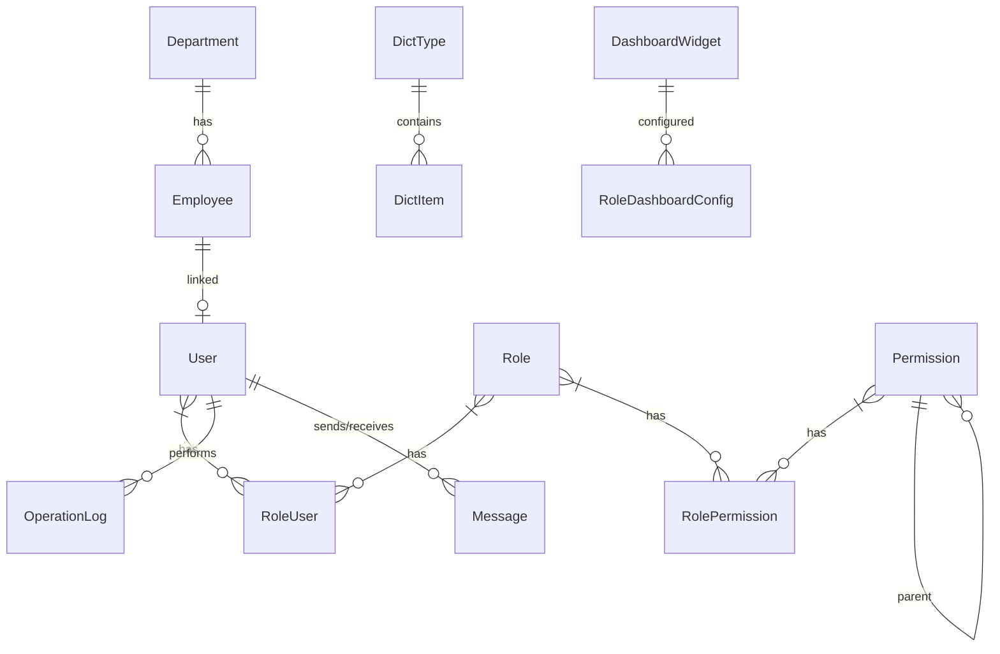

# EAMS2026 企业管理系统 — 软件设计文档 v0.1.260526

## 1. 项目概述

### 1.1 项目信息
| 项目 | 内容 |
|------|------|
| 项目名称 | EAMS2026 企业管理系统 (Enterprise Asset Management System) |
| 版本号 | v0.1.260526 |
| 开发框架 | .NET 8 + Vue 3 + TypeScript |
| 数据库 | PostgreSQL + Dapper ORM |
| API文档 | Swagger UI (开发模式下访问 /swagger) |
| 构建日期 | 2026-05-26 |

### 1.2 技术架构总览

```
┌─────────────────────────────────────────────────────────────┐
│                       前端 (Vue 3 SPA)                       │
│  ┌──────────┐ ┌──────────┐ ┌───────────┐ ┌───────────────┐ │
│  │ Pinia    │ │Vue Router│ │Element Plus│ │Element Icons  │ │
│  │ 状态管理  │ │ 路由管理  │ │ UI组件库   │ │ 图标库        │ │
│  └──────────┘ └──────────┘ └───────────┘ └───────────────┘ │
├─────────────────────────────────────────────────────────────┤
│                     HTTP/REST (Axios)                        │
├─────────────────────────────────────────────────────────────┤
│                    后端 (.NET 8 Web API)                      │
│  ┌──────────┐ ┌──────────┐ ┌───────────┐ ┌───────────────┐ │
│  │Controller│ │ Service  │ │Repository │ │ Middleware    │ │
│  │13个控制器 │ │10个服务  │ │12个仓储   │ │ 异常+日志     │ │
│  └──────────┘ └──────────┘ └───────────┘ └───────────────┘ │
├─────────────────────────────────────────────────────────────┤
│                    PostgreSQL 数据库                          │
│  ┌──────────┐ ┌──────────┐ ┌───────────┐ ┌───────────────┐ │
│  │ users    │ │employees │ │departments│ │ roles         │ │
│  │permissions││dict_types│ │dict_items │ │operation_logs │ │
│  │messages  │ │dashboard_│ │role_user  │ │role_permission│ │
│  │          │ │ widgets  │ │           │ │               │ │
│  └──────────┘ └──────────┘ └───────────┘ └───────────────┘ │
└─────────────────────────────────────────────────────────────┘
```

---

## 2. 分层架构设计

### 2.1 Domain 层（领域层）
**项目**: `EAMS2026.Domain`

| 文件 | 职责 |
|------|------|
| [Entities/](file:///d:/Codes/Projects/eams2026/src/EAMS2026.Domain/Entities) | 17个领域实体，映射数据库表 |
| [Common/](file:///d:/Codes/Projects/eams2026/src/EAMS2026.Domain/Common) | 通用模型（LoginRequest/Response, PagedResult） |
| [Interfaces/](file:///d:/Codes/Projects/eams2026/src/EAMS2026.Domain/Interfaces) | 仓储接口定义 |

### 2.2 Application 层（应用服务层）
**项目**: `EAMS2026.Application`

| 文件 | 职责 |
|------|------|
| [Services/AuthService.cs](file:///d:/Codes/Projects/eams2026/src/EAMS2026.Application/Services/AuthService.cs) | 认证、登录、修改密码、个人信息 |
| [Services/UserService.cs](file:///d:/Codes/Projects/eams2026/src/EAMS2026.Application/Services/UserService.cs) | 用户CRUD、角色分配、密码重置 |
| [Services/RoleService.cs](file:///d:/Codes/Projects/eams2026/src/EAMS2026.Application/Services/RoleService.cs) | 角色CRUD、权限分配 |
| [Services/DepartmentService.cs](file:///d:/Codes/Projects/eams2026/src/EAMS2026.Application/Services/DepartmentService.cs) | 部门树形CRUD |
| [Services/EmployeeService.cs](file:///d:/Codes/Projects/eams2026/src/EAMS2026.Application/Services/EmployeeService.cs) | 员工CRUD、Excel导入导出 |
| [Services/PermissionService.cs](file:///d:/Codes/Projects/eams2026/src/EAMS2026.Application/Services/PermissionService.cs) | 权限CRUD、树形结构 |
| [Services/DictService.cs](file:///d:/Codes/Projects/eams2026/src/EAMS2026.Application/Services/DictService.cs) | 字典类型与字典项CRUD |
| [Services/DashboardService.cs](file:///d:/Codes/Projects/eams2026/src/EAMS2026.Application/Services/DashboardService.cs) | 仪表盘统计卡片数据 |
| [Services/DashboardConfigService.cs](file:///d:/Codes/Projects/eams2026/src/EAMS2026.Application/Services/DashboardConfigService.cs) | 仪表盘组件管理、预览、角色仪表盘 |
| [Services/MessageService.cs](file:///d:/Codes/Projects/eams2026/src/EAMS2026.Application/Services/MessageService.cs) | 站内消息收发 |

### 2.3 Infrastructure 层（基础设施层）
**项目**: `EAMS2026.Infrastructure`

| 文件 | 职责 |
|------|------|
| [Services/JwtService.cs](file:///d:/Codes/Projects/eams2026/src/EAMS2026.Infrastructure/Services/JwtService.cs) | JWT Token 生成与验证 |
| [Services/DynamicDataEngine.cs](file:///d:/Codes/Projects/eams2026/src/EAMS2026.Infrastructure/Services/DynamicDataEngine.cs) | 仪表盘动态数据源执行引擎（SQL/API/Count） |
| [Data/Repositories/](file:///d:/Codes/Projects/eams2026/src/EAMS2026.Infrastructure/Data/Repositories) | 12个Dapper仓储实现 |
| [Data/DbConnectionFactory.cs](file:///d:/Codes/Projects/eams2026/src/EAMS2026.Infrastructure/Data/DbConnectionFactory.cs) | Npgsql连接工厂 |
| [Authorization/](file:///d:/Codes/Projects/eams2026/src/EAMS2026.Infrastructure/Authorization) | 自定义权限校验（v0.1.260526新增） |
| [Migrations/](file:///d:/Codes/Projects/eams2026/src/EAMS2026.Infrastructure/Migrations) | 8个数据库迁移脚本 |

### 2.4 API 层（接口层）
**项目**: `EAMS2026.Api`

| 文件 | 职责 |
|------|------|
| [Controllers/](file:///d:/Codes/Projects/eams2026/src/EAMS2026.Api/Controllers) | 13个REST控制器 |
| [Middleware/ExceptionMiddleware.cs](file:///d:/Codes/Projects/eams2026/src/EAMS2026.Api/Middleware/ExceptionMiddleware.cs) | 全局异常处理 |
| [Middleware/OperationLogMiddleware.cs](file:///d:/Codes/Projects/eams2026/src/EAMS2026.Api/Middleware/OperationLogMiddleware.cs) | 自动操作日志记录 |
| [Program.cs](file:///d:/Codes/Projects/eams2026/src/EAMS2026.Api/Program.cs) | 应用启动配置 |

---

## 3. 数据模型设计 (ER图)

### 3.1 核心实体关系



### 3.2 数据库表清单 (21张表)

| 表名 | 中文 | 主键类型 | 说明 |
|------|------|----------|------|
| `departments` | 部门表 | BIGINT | 树形结构(parent_id) |
| `employees` | 员工表 | BIGINT | 关联departments |
| `users` | 用户表 | BIGINT | 关联employees，BCrypt密码 |
| `roles` | 角色表 | BIGINT | RBAC角色定义 |
| `permissions` | 权限表 | BIGINT | 树形结构(parent_id) |
| `role_users` | 角色-用户关联 | 复合PK | 多对多 |
| `role_permissions` | 角色-权限关联 | 复合PK | 多对多 |
| `dict_types` | 字典类型表 | BIGINT | 软删除 |
| `dict_items` | 字典项表 | BIGINT | 外键关联dict_types，级联删除 |
| `operation_logs` | 操作日志表 | BIGINT | 自动记录 |
| `messages` | 消息表 | BIGINT | 站内消息 |
| `message_read_status` | 消息已读状态 | 复合PK | 多用户标记已读 |
| `dashboard_widgets` | 仪表盘组件表 | BIGINT | 组件定义 |
| `role_dashboard_config` | 角色仪表盘配置 | BIGINT | JSON存储布局 |

### 3.3 各表字段详解

**departments（部门）**
| 字段 | 类型 | 说明 |
|------|------|------|
| id | BIGINT PK | 自增主键 |
| name | VARCHAR(200) | 部门名称 |
| code | VARCHAR(50) UNIQUE | 部门编码 |
| parent_id | BIGINT NULLABLE | 上级部门ID |
| description | TEXT NULLABLE | 描述 |
| sort_order | INT DEFAULT 0 | 排序号 |
| is_deleted | BOOLEAN DEFAULT FALSE | 软删除 |
| created_at/updated_at/created_by/updated_by | 时间戳 | 审计字段 |

**employees（员工）**
| 字段 | 类型 | 说明 |
|------|------|------|
| id | BIGINT PK | 自增主键 |
| employee_no | VARCHAR(50) UNIQUE | 员工编号 |
| name | VARCHAR(100) | 姓名 |
| gender | VARCHAR(10) NULLABLE | 性别 |
| phone | VARCHAR(20) NULLABLE | 电话 |
| email | VARCHAR(200) NULLABLE | 邮箱 |
| department_id | BIGINT NULLABLE | 所属部门 |
| department_name | VARCHAR(200) NULLABLE | 部门名称(冗余) |
| position | VARCHAR(200) NULLABLE | 职位 |
| hire_date | DATE NULLABLE | 入职日期 |
| photo_url | TEXT NULLABLE | 照片URL |
| sort_order | INT DEFAULT 0 | 排序号 |
| is_deleted | BOOLEAN DEFAULT FALSE | 软删除 |

**users（用户）**
| 字段 | 类型 | 说明 |
|------|------|------|
| id | BIGINT PK | 自增主键 |
| username | VARCHAR(100) UNIQUE | 用户名 |
| password_hash | TEXT | BCrypt密码哈希 |
| employee_id | BIGINT NULLABLE | 关联员工 |
| status | BOOLEAN DEFAULT TRUE | 账户启用状态 |
| force_change_password | BOOLEAN DEFAULT FALSE | 强制修改密码 |
| last_login_at | TIMESTAMP NULLABLE | 最后登录时间 |
| is_deleted | BOOLEAN DEFAULT FALSE | 软删除 |

**roles（角色）**
| 字段 | 类型 | 说明 |
|------|------|------|
| id | BIGINT PK | 自增主键 |
| name | VARCHAR(200) | 角色名称 |
| code | VARCHAR(50) UNIQUE | 角色编码 |
| description | TEXT NULLABLE | 描述 |
| is_deleted | BOOLEAN DEFAULT FALSE | 软删除 |

**permissions（权限）**
| 字段 | 类型 | 说明 |
|------|------|------|
| id | BIGINT PK | 自增主键 |
| name | VARCHAR(200) | 权限名称 |
| code | VARCHAR(50) UNIQUE | 权限编码 |
| type | VARCHAR(20) | menu/button/api |
| parent_id | BIGINT NULLABLE | 父权限ID(树形结构) |
| sort_order | INT DEFAULT 0 | 排序号 |
| is_deleted | BOOLEAN DEFAULT FALSE | 软删除 |

**dict_types（字典类型）**
| 字段 | 类型 | 说明 |
|------|------|------|
| id | BIGINT PK | 自增主键 |
| name | VARCHAR(200) | 类型名称 |
| code | VARCHAR(50) UNIQUE | 类型编码 |
| description | TEXT NULLABLE | 描述 |
| is_deleted | BOOLEAN DEFAULT FALSE | 软删除 |

**dict_items（字典项）**
| 字段 | 类型 | 说明 |
|------|------|------|
| id | BIGINT PK | 自增主键 |
| dict_type_id | BIGINT FK | 所属字典类型 |
| label | VARCHAR(200) | 显示标签 |
| value | VARCHAR(200) | 实际值 |
| color | VARCHAR(50) NULLABLE | 显示颜色 |
| is_default | BOOLEAN DEFAULT FALSE | 是否默认 |
| sort_order | INT DEFAULT 0 | 排序号 |
| status | BOOLEAN DEFAULT TRUE | 启用状态 |
| is_deleted | BOOLEAN DEFAULT FALSE | 软删除 |

**operation_logs（操作日志）**
| 字段 | 类型 | 说明 |
|------|------|------|
| id | BIGINT PK | 自增主键 |
| user_id | BIGINT | 操作人ID |
| username | VARCHAR(200) | 操作人用户名 |
| module | VARCHAR(100) | 操作模块 |
| operation_type | VARCHAR(50) | 操作类型 |
| description | TEXT NULLABLE | 操作描述 |
| entity_type | VARCHAR(100) NULLABLE | 实体类型 |
| entity_id | BIGINT NULLABLE | 实体ID |
| ip_address | VARCHAR(50) NULLABLE | IP地址 |
| old_value | TEXT NULLABLE | 变更前值(JSON) |
| new_value | TEXT NULLABLE | 变更后值(JSON) |
| created_at | TIMESTAMP | 操作时间 |

**messages（站内消息）**
| 字段 | 类型 | 说明 |
|------|------|------|
| id | BIGINT PK | 自增主键 |
| sender_id | BIGINT | 发送者ID |
| title | VARCHAR(200) | 标题 |
| content | TEXT | 内容 |
| type | VARCHAR(50) DEFAULT 'notification' | notification/broadcast/message |
| created_at | TIMESTAMP | 发送时间 |

**message_read_status（消息已读状态）**
| 字段 | 类型 | 说明 |
|------|------|------|
| message_id | BIGINT PK | 消息ID |
| user_id | BIGINT PK | 用户ID |
| read_at | TIMESTAMP | 阅读时间 |

**dashboard_widgets（仪表盘组件）**
| 字段 | 类型 | 说明 |
|------|------|------|
| id | BIGINT PK | 自增主键 |
| widget_key | VARCHAR(100) UNIQUE | 组件唯一标识 |
| widget_name | VARCHAR(200) | 组件名称 |
| widget_type | VARCHAR(50) | stat_card/table/chart/list |
| description | TEXT NULLABLE | 描述 |
| icon | VARCHAR(100) NULLABLE | 图标 |
| default_config | TEXT NULLABLE | 默认配置(JSON) |
| data_source_type | VARCHAR(50) | 数据源类型 |
| data_source_config | TEXT NULLABLE | 数据源配置(JSON) |
| layout_config | TEXT NULLABLE | 布局配置(JSON) |
| refresh_interval | INT DEFAULT 0 | 刷新间隔(秒) |
| sort_order | INT DEFAULT 0 | 排序号 |
| is_active | BOOLEAN DEFAULT TRUE | 启用状态 |

**role_dashboard_config（角色仪表盘配置）**
| 字段 | 类型 | 说明 |
|------|------|------|
| id | BIGINT PK | 自增主键 |
| role_id | BIGINT | 角色ID |
| config | TEXT NULLABLE | 配置内容(JSON) |

---

## 4. API接口设计

### 4.1 API响应格式

所有API返回统一格式：
```json
{
  "success": true,
  "data": {},
  "message": "操作成功"
}
```

分页返回格式：
```json
{
  "success": true,
  "data": {
    "items": [],
    "total": 100,
    "page": 1,
    "pageSize": 20,
    "totalPages": 5
  }
}
```

### 4.2 Swagger API 文档

项目集成了 **Swagger UI** 作为API文档和测试界面。

**访问地址**: `http://localhost:5106/swagger`（开发模式下）

**功能特性**:
- 自动生成RESTful API文档
- JWT Bearer Token认证支持（点击右上角"Authorize"按钮输入令牌）
- 支持在线测试API接口
- 支持导出OpenAPI JSON规范

**认证方式**:
1. 调用 `POST /api/auth/login` 获取JWT令牌
2. 点击右上角"Authorize"按钮
3. 输入格式: `Bearer {token}`（注意Bearer后有空格）
4. 点击"Authorize"确认

### 4.3 接口清单

#### 认证模块 `/*`

| 方法 | 路径 | 说明 | 鉴权 |
|------|------|------|------|
| POST | `/api/auth/login` | 用户登录 | 无 |
| GET | `/api/auth/profile` | 获取个人信息 | JWT |
| PUT | `/api/auth/change-password` | 修改密码 | JWT |
| PUT | `/api/auth/profile` | 更新个人信息 | JWT |

#### 部门管理 `/api/department`

| 方法 | 路径 | 说明 | 权限 |
|------|------|------|------|
| GET | `/api/department/tree` | 获取部门树 | department |
| GET | `/api/department/{id}` | 获取部门详情 | department |
| POST | `/api/department` | 创建部门 | department |
| PUT | `/api/department` | 更新部门 | department |
| DELETE | `/api/department/{id}` | 删除部门 | department |

#### 员工管理 `/api/employee`

| 方法 | 路径 | 说明 | 权限 |
|------|------|------|------|
| GET | `/api/employee` | 获取员工列表 | employee |
| GET | `/api/employee/{id}` | 获取员工详情 | employee |
| GET | `/api/employee/by-department/{deptId}` | 按部门查员工 | employee |
| POST | `/api/employee` | 创建员工 | employee |
| PUT | `/api/employee` | 更新员工 | employee |
| DELETE | `/api/employee/{id}` | 删除员工 | employee |
| POST | `/api/employee/import` | Excel批量导入 | employee |

#### 用户管理 `/api/user`

| 方法 | 路径 | 说明 | 权限 |
|------|------|------|------|
| GET | `/api/user?page=&pageSize=&keyword=` | 获取用户列表(分页) | user |
| GET | `/api/user/{id}` | 获取用户详情 | user |
| POST | `/api/user` | 创建用户 | user |
| PUT | `/api/user` | 更新用户 | user |
| DELETE | `/api/user/{id}` | 删除用户 | user |
| POST | `/api/user/check-username` | 检查用户名重复 | user |
| POST | `/api/user/{id}/assign-roles` | 分配角色 | user |
| POST | `/api/user/{id}/reset-password` | 重置密码 | user |

#### 角色管理 `/api/role`

| 方法 | 路径 | 说明 | 权限 |
|------|------|------|------|
| GET | `/api/role` | 获取角色列表 | role |
| GET | `/api/role/{id}` | 获取角色详情 | role |
| POST | `/api/role` | 创建角色 | role |
| PUT | `/api/role` | 更新角色 | role |
| DELETE | `/api/role/{id}` | 删除角色 | role |
| POST | `/api/role/{id}/assign-permissions` | 分配权限 | role |

#### 权限管理 `/api/permission`

| 方法 | 路径 | 说明 | 权限 |
|------|------|------|------|
| GET | `/api/permission` | 获取权限列表 | permission |
| GET | `/api/permission/tree` | 获取权限树 | permission |
| GET | `/api/permission/by-role/{roleId}` | 获取角色权限 | permission |
| GET | `/api/permission/{id}` | 获取权限详情 | permission |
| POST | `/api/permission` | 创建权限 | permission |
| PUT | `/api/permission` | 更新权限 | permission |
| DELETE | `/api/permission/{id}` | 删除权限 | permission |

#### 字典管理 `/api/dict`

| 方法 | 路径 | 说明 | 权限 |
|------|------|------|------|
| GET | `/api/dict/types` | 获取字典类型列表 | dict |
| GET | `/api/dict/types/{id}` | 获取类型详情 | dict |
| POST | `/api/dict/types` | 创建字典类型 | dict |
| PUT | `/api/dict/types` | 更新字典类型 | dict |
| DELETE | `/api/dict/types/{id}` | 删除字典类型 | dict |
| GET | `/api/dict/items` | 获取字典项列表(type_id参数) | dict |
| GET | `/api/dict/items/{code}` | 按编码获取字典项(公开) | 无 |
| GET | `/api/dict/items/detail/{id}` | 获取字典项详情 | dict |
| POST | `/api/dict/items` | 创建字典项 | dict |
| PUT | `/api/dict/items` | 更新字典项 | dict |
| DELETE | `/api/dict/items/{id}` | 删除字典项 | dict |

#### 仪表盘 `/api/dashboard`

| 方法 | 路径 | 说明 | 权限 |
|------|------|------|------|
| GET | `/api/dashboard/stats` | 获取统计卡片数据 | dashboard-config |
| GET | `/api/dashboard/my-dashboard` | 获取当前用户仪表盘 | dashboard-config |
| GET | `/api/dashboard/widgets` | 获取所有组件 | dashboard-config |
| GET | `/api/dashboard/config?roleId=` | 获取角色仪表盘配置 | dashboard-config |
| POST | `/api/dashboard/config` | 保存角色仪表盘配置 | dashboard-config |
| POST | `/api/dashboard/widget` | 新增组件 | dashboard-config |
| PUT | `/api/dashboard/widget/{id}` | 更新组件 | dashboard-config |
| DELETE | `/api/dashboard/widget/{id}` | 删除组件 | dashboard-config |
| POST | `/api/dashboard/widget/preview` | 预览组件数据 | dashboard-config |

#### 操作日志 `/api/operation-log`

| 方法 | 路径 | 说明 | 权限 |
|------|------|------|------|
| GET | `/api/operation-log` | 获取日志(分页+过滤) | operation-log |
| GET | `/api/operation-log/mine` | 获取我的日志 | JWT |
| DELETE | `/api/operation-log/clear` | 清除日志 | operation-log |

#### 站内消息 `/api/message`

| 方法 | 路径 | 说明 | 权限 |
|------|------|------|------|
| GET | `/api/message/inbox` | 收件箱(分页) | message |
| GET | `/api/message/sent` | 已发送(分页) | message |
| GET | `/api/message/{id}` | 消息详情(标记已读) | message |
| POST | `/api/message` | 发送消息 | message |
| GET | `/api/message/unread-count` | 未读消息数 | JWT |

#### 打印 `/api/print`

| 方法 | 路径 | 说明 |
|------|------|------|
| POST | `/api/print/pdf` | 生成PDF |
| POST | `/api/print/html-to-pdf` | HTML转PDF |

#### 导入导出 `/api/import-export`

| 方法 | 路径 | 说明 |
|------|------|------|
| POST | `/api/import-export/export-employees` | 导出员工Excel |
| POST | `/api/import-export/import-employees` | 导入员工Excel |

#### 考勤管理 `/api/attendance`

| 方法 | 路径 | 说明 | 权限 |
|------|------|------|------|
| POST | `/api/attendance/report/search` | 查询考勤报表 | attendance |
| GET | `/api/attendance/employees` | 获取考勤员工列表 | attendance |
| POST | `/api/attendance/records/search` | 查询考勤记录(分页) | attendance |
| GET | `/api/attendance/records/{id}` | 获取考勤记录详情 | attendance |
| POST | `/api/attendance/records` | 创建考勤记录 | attendance |
| PUT | `/api/attendance/records/{id}` | 更新考勤记录 | attendance |
| DELETE | `/api/attendance/records/{id}` | 删除考勤记录 | attendance |
| GET | `/api/attendance/day-types` | 获取日期类型列表 | attendance |
| POST | `/api/attendance/day-types` | 创建日期类型 | attendance |
| PUT | `/api/attendance/day-types/{id}` | 更新日期类型 | attendance |
| DELETE | `/api/attendance/day-types/{id}` | 删除日期类型 | attendance |
| GET | `/api/attendance/scheme-classes` | 获取班次列表 | attendance |
| POST | `/api/attendance/scheme-classes` | 创建班次 | attendance |
| PUT | `/api/attendance/scheme-classes/{id}` | 更新班次 | attendance |
| DELETE | `/api/attendance/scheme-classes/{id}` | 删除班次 | attendance |
| GET | `/api/attendance/plan-times` | 获取排班计划列表 | attendance |
| POST | `/api/attendance/plan-times` | 创建排班计划 | attendance |
| PUT | `/api/attendance/plan-times/{id}` | 更新排班计划 | attendance |
| DELETE | `/api/attendance/plan-times/{id}` | 删除排班计划 | attendance |
| GET | `/api/attendance/plan-times/{planId}/ref-classes` | 获取计划关联班次 | attendance |
| POST | `/api/attendance/plan-ref-classes` | 添加计划关联班次 | attendance |
| DELETE | `/api/attendance/plan-ref-classes/{id}` | 删除计划关联班次 | attendance |
| GET | `/api/attendance/records/{recordId}/events` | 获取考勤事件列表 | attendance |
| POST | `/api/attendance/events` | 创建考勤事件 | attendance |
| PUT | `/api/attendance/events/{id}` | 更新考勤事件 | attendance |
| DELETE | `/api/attendance/events/{id}` | 删除考勤事件 | attendance |
| GET | `/api/attendance/holidays` | 获取假日列表 | attendance |
| POST | `/api/attendance/holidays` | 创建假日 | attendance |
| PUT | `/api/attendance/holidays/{id}` | 更新假日 | attendance |
| DELETE | `/api/attendance/holidays/{id}` | 删除假日 | attendance |
| GET | `/api/attendance/employee-ref-classes` | 获取员工班次关联 | attendance |
| POST | `/api/attendance/employee-ref-classes` | 添加员工班次关联 | attendance |
| DELETE | `/api/attendance/employee-ref-classes/{id}` | 删除员工班次关联 | attendance |
| GET | `/api/attendance/fee-calculators` | 获取费用计算器 | attendance |
| POST | `/api/attendance/fee-calculators` | 创建费用计算器 | attendance |
| PUT | `/api/attendance/fee-calculators/{id}` | 更新费用计算器 | attendance |
| DELETE | `/api/attendance/fee-calculators/{id}` | 删除费用计算器 | attendance |

**HWATT数据同步接口**:

| 方法 | 路径 | 说明 | 权限 |
|------|------|------|------|
| POST | `/api/attendance/sync-employees` | 从HWATT同步员工到考勤系统 | attendance |
| POST | `/api/attendance/import-device` | 从考勤机导入指定员工考勤数据 | attendance |
| POST | `/api/attendance/import-all` | 导入所有员工考勤数据 | attendance |
| POST | `/api/attendance/sync-card-records` | 从HWATT同步打卡记录到本地 | attendance |
| GET | `/api/attendance/hwatt-card-count` | 查询已同步的HWATT打卡记录数 | attendance |

---

## 5. 前端路由与组件树

### 5.1 路由结构

```
/login (Login.vue)                     -- 登录页面，无需认证
/ (MainLayout.vue)                     -- 主布局，需要认证
  ├── /dashboard (Dashboard.vue)       -- 仪表盘首页
  ├── /department (Department.vue)     -- 部门管理
  ├── /employee (Employee.vue)          -- 员工管理
  ├── /user (User.vue)                 -- 用户管理
  ├── /role (Role.vue)                 -- 角色管理
  ├── /permission (Permission.vue)     -- 权限管理
  ├── /test (TestMenu.vue)             -- 测试菜单
  │   ├── /test/permission1             -- 权限测试1
  │   └── /test/permission2             -- 权限测试2
  ├── /dict (Dict.vue)                 -- 字典管理
  ├── /operation-log (OperationLog.vue)-- 操作日志
  ├── /dashboard-config (DashboardConfig.vue) -- 仪表盘配置
  ├── /message/inbox (Inbox.vue)       -- 收件箱
  ├── /message/sent (Sent.vue)         -- 已发送
  ├── /message/compose (Compose.vue)    -- 写消息
  ├── /attendance/report (AttendanceReport.vue) -- 考勤报表
  ├── /attendance/records (AttendanceRecords.vue) -- 考勤记录
  ├── /attendance/day-types (DayTypes.vue) -- 日期类型管理
  ├── /attendance/scheme-classes (SchemeClasses.vue) -- 班次管理
  ├── /attendance/plan-times (PlanTimes.vue) -- 排班计划
  ├── /attendance/holidays (Holidays.vue) -- 假日管理
  ├── /attendance/employee-schemes (EmployeeSchemes.vue) -- 员工班次关联
  └── /profile (Profile.vue)           -- 个人中心
```

### 5.2 组件调用关系

```
App.vue
  └── <router-view>
       ├── Login.vue → Pinia authStore.login()
       └── MainLayout.vue
            ├── <el-menu> (侧边栏 + 权限过滤)
            ├── <router-view> (内容区)
            │    ├── Dashboard.vue → dashboardApi
            │    ├── Department.vue → departmentApi
            │    ├── Employee.vue → employeeApi + Excel导入导出
            │    ├── User.vue → userApi
            │    ├── Role.vue → roleApi
            │    ├── Permission.vue → permissionApi
            │    ├── Dict.vue → dictApi
            │    ├── OperationLog.vue → operationLogApi
            │    ├── DashboardConfig.vue → dashboardApi
            │    ├── Inbox.vue / Sent.vue / Compose.vue → messageApi
            │    └── TestMenu/TestPermission1/TestPermission2
            └── 顶部右侧: 消息通知 + 用户头像 + 下拉菜单
```

---

## 6. 安全设计

### 6.1 认证流程
1. 用户提交 username/password
2. AuthService 查询 User 表
3. BCrypt.Verify() 验证密码
4. JwtService.GenerateToken() 生成 Token（含 user_id、roles、permissions）
5. 前端存储 Token 到 localStorage
6. 每次请求携带 `Authorization: Bearer {token}`

### 6.2 权限校验机制（v0.1.260526）

**后端**: 自定义 `PermissionHandler` + `IAuthorizationRequirement`
- 控制器标注 `[Authorize(Policy = "模块编码")]`
- Handler 从 JWT claims 读取 `permission` 和 `role`
- `super_admin` 角色拥有所有权限

**前端**: 
- 路由守卫: `router.beforeEach` 检查 token 存在与过期
- 导航菜单: `MainLayout.vue` 中 `v-if="hasPermission('模块编码')"`
- 组件指令: `v-permission="'权限编码'"` 隐藏无权限的元素
- Axios 拦截器: 401 自动跳转登录

### 6.3 JWT Token 配置
```json
{
  "Jwt": {
    "SecretKey": "至少32个字符的密钥",
    "Issuer": "EAMS2026",
    "Audience": "EAMS2026",
    "ExpirationMinutes": 480
  }
}
```

### 6.4 密码策略
- BCrypt 哈希存储
- 首次登录或重置密码后 `ForceChangePassword=true`
- 强制修改密码时可接受任意密码

---

## 7. 中间件管道

```
HTTP Request
  → ExceptionMiddleware (全局异常捕获)
  → Swagger UI (仅开发环境)
  → ResponseCompression (gzip)
  → CORS Middleware
  → Authentication Middleware (JWT验证)
  → Authorization Middleware (权限校验)
  → OperationLogMiddleware (操作日志，仅200-299记录)
  → Controller Action
  → Response
```

---

## 8. 部署与运行

### 8.1 环境依赖

| 工具 | 路径 | 版本 |
|------|------|------|
| .NET SDK | `D:\Scoop\apps\dotnet8-sdk\current` | 8.0 |
| PostgreSQL | `D:\Scoop\apps\postgresql\current\bin` | - |
| Node.js | `D:\Scoop\apps\nodejs-lts\current` | LTS |

### 8.2 启动命令

```powershell
# 后端 (监听所有网络接口，局域网可用)
& "D:\Scoop\apps\dotnet8-sdk\current\dotnet.exe" run --project src\EAMS2026.Api --urls "http://0.0.0.0:5106"

# 前端 (监听所有网络接口，局域网可用)
$env:Path = "D:\Scoop\apps\nodejs-lts\current;$env:Path"
cd src\EAMS2026.Web
npm run dev
```

访问地址:
- 本机: `http://localhost:5173`
- 局域网其他设备: `http://<服务器IP>:5173`

### 8.3 构建命令

```powershell
# 后端编译
& "D:\Scoop\apps\dotnet8-sdk\current\dotnet.exe" build src\EAMS2026.Api

# 前端编译
$env:Path = "D:\Scoop\apps\nodejs-lts\current;$env:Path"
cd src\EAMS2026.Web
npm run build
```